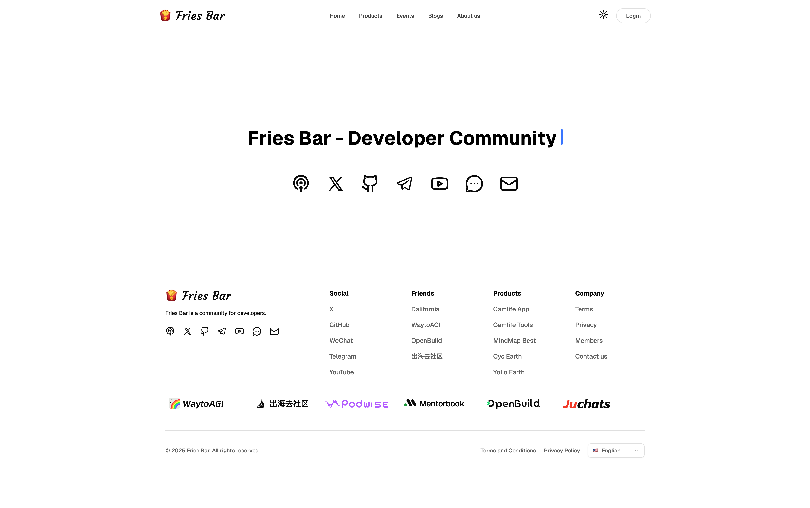

  
  <h1>Podify</h1>

  
Developer Community

  
  
  
  
  
  

  

## 🔨 Tech Stack

- ⚡ Framework - [TanStack Start](https://tanstack.com/start)
- 🧩 Language - [TypeScript](https://www.typescriptlang.org)
- 🛣️ Router - [TanStack Router](https://tanstack.com/router)
- ⚙️ Build Tool - [Vite](https://vitejs.dev)
- 🌬️ Styling - [Tailwind CSS](https://tailwindcss.com)
- 🎛️ UI Library - [Radix UI](https://www.radix-ui.com)
- 🐻 State Management - [TanStack Store](https://tanstack.com/store)
- 🌐 Multi-language - [i18next](https://www.i18next.com)
- ✅ Schema Validations - [Zod](https://zod.dev)
- 🧹 Formatter and Linter - [Biome](https://biomejs.dev)
- 🪝 Git hooks - [Lefthook](https://lefthook.dev)
- 📊 Traffic Analysis - [Umami](https://umami.is)

## 👥 Contributors

<table>
	<tbody>
		<tr>
      <td align="center">
        <a href="https://github.com/sun0225SUN">
            
             
            <b>Guoqi Sun</b>
        </a>
         
        <b>💻 & 🎨 & 📝</b>
      </td>
		</tr>
	<tbody>
</table>

## 🍭 Community

- [Telegram](https://t.me/guoqisun)

## ⭐️ Star History

## 🪪 License

Licensed under the [GNU General Public License v3.0](LICENSE).